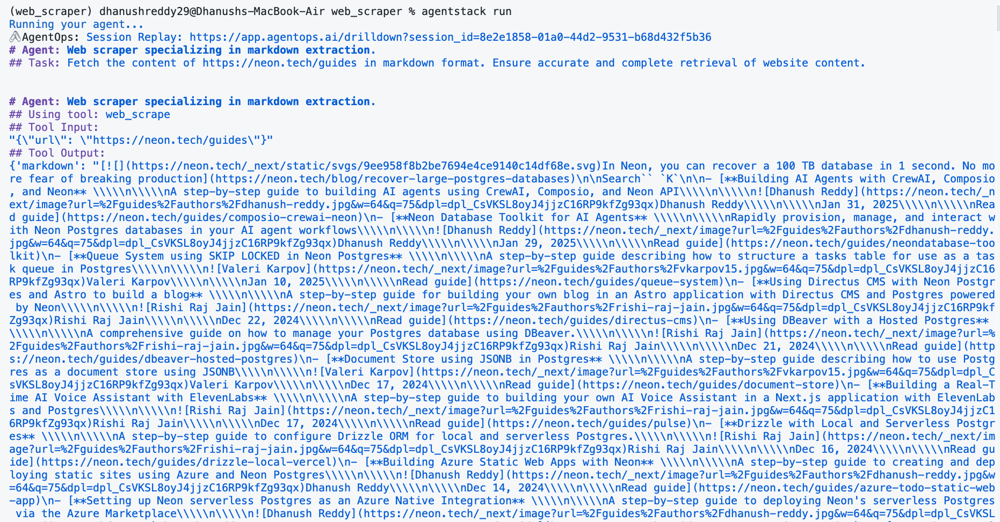
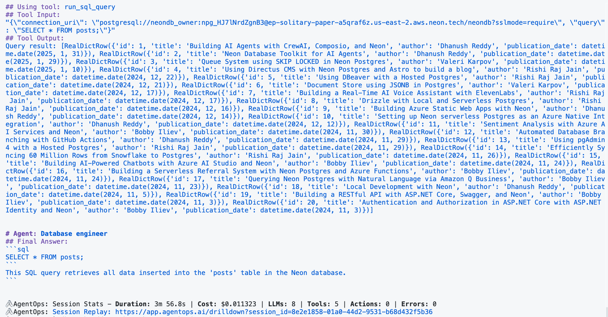
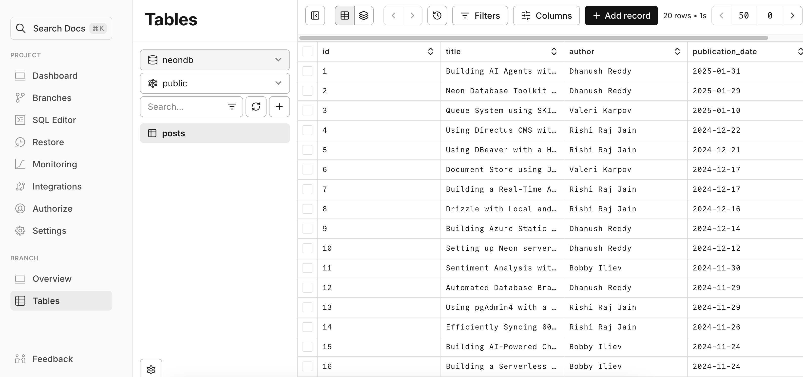
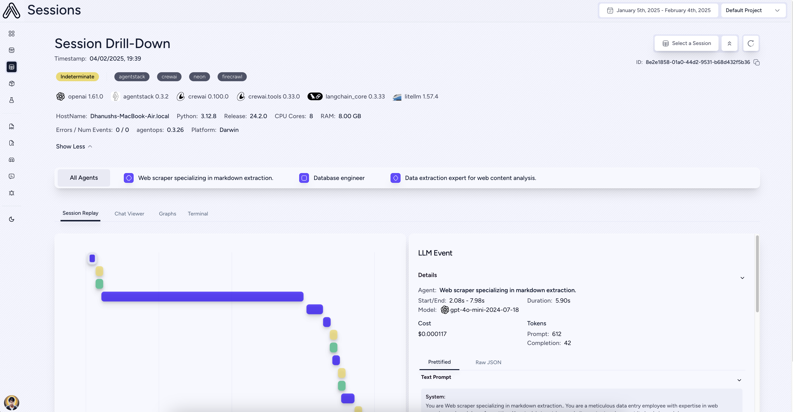

# Web Scraper Agent with AgentStack and Neon

This guide provides a quickstart example of a **Web Scraper AI Agent** built using **AgentStack**, leveraging tools like **Neon** and **Firecrawl**.

- **AgentStack**: Think of AgentStack as a toolkit to rapidly build and manage your AI agent projects. It streamlines the process of creating agents, tasks, and integrating various tools. AgentStack uses **CrewAI** under the hood for orchestrating agents.
- **Neon**: In this example, we'll use Neon to store the data extracted by your web scraper agent.
- **Firecrawl**: Firecrawl is a web scraping tool that allows AI agents to effectively gather data from websites.

In this example, you will create a crew of AI agents that work together to scrape a website, extract information, and store it in a Neon database, all powered by AgentStack.

Specifically, you will scrape the [Neon guides page](https://neon.tech/guides) to extract blog post metadata like titles, authors, and dates. This extracted data will then be stored in a Neon database, powered by AI agents, without requiring any manual coding on your part!

## ✨ What you will build

This example will show you how to:

- Set up an **AgentStack** project to create an AI agent.
- Utilize the **AgentStack CLI** to generate agents and tasks.
- Equip your agents with **tools** like **Neon** and **Firecrawl** for data storage and web scraping.
- Run your agent crew to **scrape a website**, **extract blog post metadata (titles, authors, dates)**, and **store it in a Neon Postgres database**.
- Use **AgentOps** for observability of your agent's execution.

## 🚀 Get started

### Prerequisites

Before you start, you'll need a few things:

1.  **Python 3.10 or higher**: Ensure you have Python installed on your computer. You can download it from [python.org](https://www.python.org).
2.  **uv package installer**: We recommend using `uv` for faster dependency installation. Install it by following the instructions at [astral-sh/uv](https://github.com/astral-sh/uv). (Alternatively, you can use `poetry`).
3.  **Accounts and API Keys**: You'll need accounts and API keys for these services:
    - **OpenAI API key**: We'll use OpenAI's `gpt-4o-mini` model to power our AI agents. Get an OpenAI API key at [platform.openai.com](https://platform.openai.com).
    - **Neon account**: Sign up for a free Neon account at [neon.tech](https://neon.tech/). You'll need a Neon API key to connect to your Neon database.
    - **Firecrawl account**: Sign up for a Firecrawl account at [firecrawl.dev](https://firecrawl.dev). You'll need a Firecrawl API key to use the web scraping tool.
    - **AgentOps account**: Sign up for an AgentOps account at [agentops.ai](https://agentops.ai) if you want to leverage agent observability features. You'll need an AgentOps API key.

### Installation and setup

1.  **Clone this repository:**

    First, download the code for this example. Open your terminal or command prompt and run:

    ```bash
    git clone https://github.com/neondatabase-labs/agentstack-neon-example web_scraper
    cd web_scraper
    ```

2.  **Install dependencies:**

    We use `uv` to install the necessary Python libraries defined in `pyproject.toml`. Run:

    ```bash
    uv pip install --requirements pyproject.toml
    ```

    If you don't have `uv` installed, you can use `poetry` to install the dependencies:

    ```bash
    poetry install
    ```

3.  **Configure API keys:**

    You need to provide your API keys to the example code.

    - **Copy the example environment file:**

      ```bash
      cp .env.example .env  # On Linux/macOS
      ```

    - **Open the `.env` file** in a text editor.
    - **Fill in your API keys** in the `.env` file. It should look like this, adding your keys after the `=` sign:

      ```env
      OPENAI_API_KEY=YOUR_OPENAI_API_KEY
      NEON_API_KEY=YOUR_NEON_API_KEY
      FIRECRAWL_API_KEY=YOUR_FIRECRAWL_API_KEY
      AGENTOPS_API_KEY=YOUR_AGENTOPS_API_KEY
      ```

      **Where to find your API Keys:**

      - **OpenAI API Key:** Create a new API key at [OpenAI Platform](https://platform.openai.com/api-keys).
      - **Neon API Key:** Go to your [Neon Console](https://console.neon.tech/app/settings/api-keys) and find it under **Developer settings**.
      - **Firecrawl API Key:** You can find your Firecrawl API key in your [Firecrawl dashboard](https://www.firecrawl.dev/app).
      - **AgentOps API Key:** You can find your AgentOps API key in your [AgentOps Project Settings](https://app.agentops.ai/settings/projects).

### Run the Web Scraper Agent!

Now you are ready to run the web scraper agent crew. Just execute this command in your terminal from the project's root directory:

```bash
agentstack run
```

This command will:

- Initialize the AgentStack environment.
- Load the agent and task configurations from the `src/config` directory.
- Create a crew of AI agents as defined in `src/crew.py`.
- Execute the tasks sequentially as defined in `src/crew.py` and `src/config/tasks.yaml`.
- Utilize the **Neon** and **Firecrawl** tools within the agents' tasks.
- Print the final output to your terminal.

**The agent will scrape the Neon blog guides page, extract blog post titles, authors, and dates, and then store this data in your Neon database.**

You should see the output of the agent's execution in the terminal, including the SQL query generated and executed by the `content_storer` agent!

Here is a sample output of the Web Scraper Agent:




You can verify that the agent has added the extracted data to the Neon database by checking the Neon console.



## AgentStack CLI - Build and Customize your Crew

AgentStack provides a powerful Command Line Interface (CLI) to help you build and customize your agent crews efficiently. Here are some useful commands:

### Generating Agents and Tasks

- **Generate a new Agent:**

  ```bash
  agentstack generate agent <agent_name>
  ```

  This command creates a new agent definition in `src/crew.py` and adds a configuration file in `src/config/agents.yaml`.

- **Generate a new Task:**

  ```bash
  agentstack generate task <task_name>
  ```

  This command creates a new task definition in `src/crew.py` and adds a configuration file in `src/config/tasks.yaml`.

### Managing Tools

- **Add a Tool:**

  ```bash
  agentstack tools add <tool_name>
  ```

  This command integrates a pre-built tool into your AgentStack project. In this example, we've already added `neon` and `firecrawl`.

- **List Available Tools:**

  ```bash
  agentstack tools list
  ```

  This command shows you a list of tools available in AgentStack that you can add to your agents.

#### Understanding Neon Tool actions

AgentStack's Neon tool integration equips agents with a suite of pre-built actions to interact with Neon serverless Postgres databases. These actions are automatically available to any agent you equip with the Neon tool, like the `content_storer` agent in our example. The Neon tool provides the following actions:

- **`create_database`**: This action allows your agent to create a new Neon project and database on demand. It returns a connection URI, which is essential for subsequent database interactions. By default, it creates a database named `neondb` with the role `neondb_owner`. This is particularly useful for agents that need to manage their own isolated databases or when the database needs to be created as part of the agent workflow.

- **`execute_sql_ddl`**: Agents use this action to execute Data Definition Language (DDL) commands. DDL commands are used to define the database schema, such as creating, altering, or dropping tables. For instance, the `content_storer` agent uses this action to create the `posts` table in the Neon database.

- **`run_sql_query`**: This action enables agents to run Data Manipulation Language (DML) queries like `SELECT`, `INSERT`, `UPDATE`, and `DELETE`. In the example, the `content_storer` agent uses this action to insert the scraped blog post metadata into the `posts` table and to formulate and test a `SELECT` query to retrieve the data. The results from these queries are returned to the agent as formatted strings, allowing the agent to process and reason about the data.

These actions empower your agents to fully manage and utilize Neon databases within their workflows, from database creation and schema definition to data manipulation and retrieval, all without requiring manual coding of database interactions.

#### Understanding Firecrawl Tool actions

AgentStack's Firecrawl tool integration provides agents with a set of actions to perform web scraping tasks. These actions are readily available to any agent equipped with the Firecrawl tool, like the `web_scraper` agent in our example. The Firecrawl tool offers the following actions:

- **`web_scrape`**: This action allows your agent to scrape the content of a single webpage and retrieve it in markdown format. It's designed for efficiently extracting content from individual URLs when you need the content of a specific page. Your agent provides a URL, and Firecrawl returns the webpage's content as markdown text.

- **`web_crawl`**: For more extensive data gathering, the `web_crawl` action enables your agent to initiate a web crawl starting from a given URL. This action not only scrapes the initial URL but also explores and scrapes content from linked pages that are children of the starting URL. It's important to note that the crawl is limited to sublinks of the provided URL, preventing it from venturing to entirely separate sections of a website or different domains. This action is asynchronous and returns a `crawl_id`.

- **`retrieve_web_crawl`**: Since `web_crawl` is an asynchronous operation, you use the `retrieve_web_crawl` action to get the results of a crawl that was initiated previously using the `web_crawl` action. This action requires the `crawl_id` that was returned by the initial `web_crawl` action. It checks the status of the crawl and returns the scraped content once the crawl is complete. Agents can use this action in a loop or after a delay to check for and retrieve crawl results, allowing for more complex workflows where web crawling is part of a longer process.

These actions equip your agents with powerful web scraping capabilities, ranging from simple single-page content extraction to comprehensive crawling of website sections, enabling them to gather web data effectively as part of their tasks.

## AgentStack & AgentOps: Powering Your AI Agent Development

**AgentStack** is more than just a scaffolding tool; it's your starting point for building sophisticated AI agent applications. It simplifies project setup, agent and task creation, and tool integration.

**AgentOps**, from the same team behind AgentStack, provides crucial **observability** for your AI agents. By integrating AgentOps into your AgentStack projects (as shown in `src/main.py`), you gain:

- **Detailed Execution Graphs**: Visualize the step-by-step execution of your agents, making it easier to understand the agent workflow and debug issues.
- **LLM Cost Tracking**: Monitor your spending on LLM providers, helping you manage costs effectively.
- **Agent Benchmarking**: Evaluate your agents' performance against various benchmarks to ensure quality and effectiveness.
- **Security and Compliance**: Detect potential security vulnerabilities like prompt injection, enhancing the robustness of your agents.



## 📚 Learn more

Want to dive deeper into the technologies used in this example? Check out these resources:

- [AgentStack Documentation](https://docs.agentstack.sh/introduction)
- [CrewAI Documentation](https://docs.crewai.com/introduction)
- [Neon API Documentation](https://api-docs.neon.tech/reference/getting-started-with-neon-api)
- [Firecrawl Documentation](https://docs.firecrawl.dev/introduction)
- [AgentOps Documentation](https://docs.agentops.ai/)

## 🤝 Contributing

We welcome contributions! If you have ideas to improve this example, find bugs, or want to add new features, please open an issue or submit a pull request. Your feedback and contributions are highly appreciated!

> 🪩 Project built with [AgentStack](https://github.com/AgentOps-AI/AgentStack)
